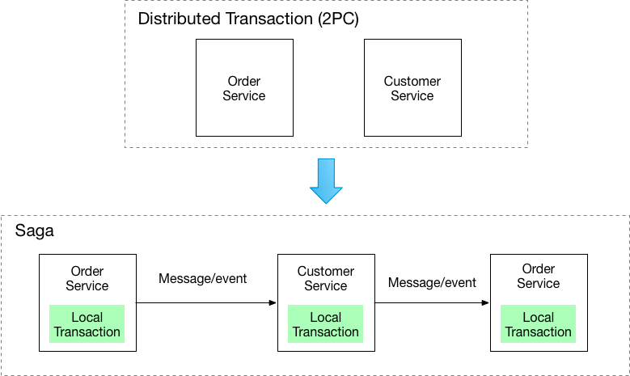
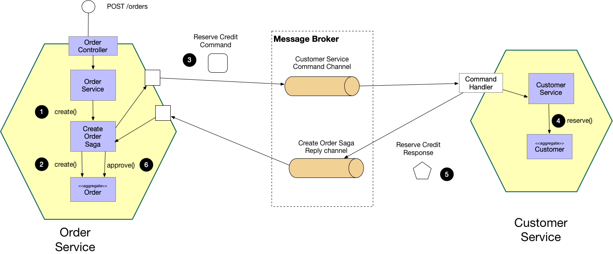

## SAGA

There are two ways of coordination sagas:

- **Choreography** - each local transaction publishes domain events that trigger local transactions in other services
- **Orchestration** - an orchestrator (object) tells the participants what local transactions to execute

### Example: Choreography-based saga

1) The `Order Service` receives the `POST /orders` request and creates an `Order` in a `PENDING` state
2) It then emits an `Order Created` event
3) The `Customer Service`’s event handler attempts to reserve credit
4) It then emits an event indicating the outcome
5) The `OrderService`’s event handler either approves or rejects the `Order`

### Example: Orchestration-based saga

1) The `Order Service` receives the `POST /orders` request and creates the `Create Order` saga orchestrator
2) The saga orchestrator creates an `Order` in the `PENDING` state
3) It then sends a `Reserve Credit` command to the `Customer Service`
4) The `Customer Service` attempts to reserve credit
5) It then sends back a reply message indicating the outcome
6) The saga orchestrator either approves or rejects the `Order`